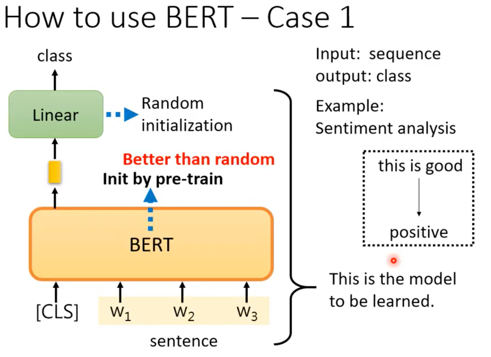

# Bert
self-supervised learning
> bert has the same encoder as transformer
> seq2seq model
 

## Masking input: 填空

随机盖住input的token（用预定义好的mask token 或者随机替换掉），训练bert 学会填空，参数为linear 变换和transformer里面的
##Next sentence prediction(帮助不大：RoBERTa)
两个句子是不是接在一起？
可能因为这个任务太简单了 
之后提出了sop: sentence order prediction判断句子顺序对不对->ALBERT

##Pre-train -> down stream task
之后用数据刺激，可做下游任务

GLUE:多任务nlp集

##Use BERT
> 用BERT是semi-supervised, pre-train是无监督（self-supervised）,下游任务fine-tune是有监督的

###Case 1: 情感分析： input sequence --> output 一个类别

linear 和 BERT一起Train，只关心CLS的输出
###case 2: POS tagging词性标注
input: seq
output :与输入同样长的seq
###case3: natural language inference

 sep是分割符

###case 4: QA

extraction-based:答案出现在文章里面
返回两个integer是原文中的索引
›

##seq2seq BERT

把encoder弄坏，decoder恢复出来弄坏前的seq
如何弄坏？

##Why does BERT work?
